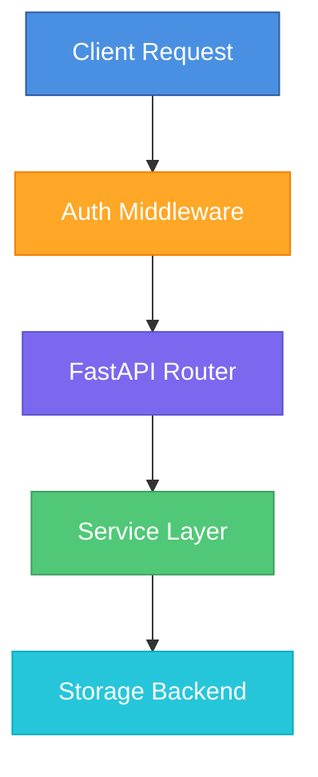

# Architecture

vcpkg-harbor is built with a modular, plugin-based architecture.

## Project Structure

```
src/vcpkg_harbor/
├── __init__.py           # Package version
├── __main__.py           # CLI entry point
├── app.py                # FastAPI application factory
├── core/                 # Core infrastructure
│   ├── config.py         # Configuration management
│   ├── logging.py        # Structured logging
│   ├── exceptions.py     # Custom exceptions
│   └── dependencies.py   # FastAPI dependencies
├── api/                  # REST API endpoints
│   ├── cache.py          # vcpkg protocol (HEAD/GET/PUT)
│   ├── health.py         # Health check endpoints
│   └── metrics.py        # Prometheus metrics
├── storage/              # Storage layer
│   ├── base.py           # StorageBackend protocol
│   ├── registry.py       # Backend discovery
│   └── backends/         # Backend implementations
├── services/             # Business logic
│   ├── cache_service.py  # Package operations
│   ├── stats_service.py  # Statistics
│   └── package_service.py # Package queries
├── auth/                 # Authentication
│   ├── middleware.py     # Auth middleware
│   └── providers.py      # Auth providers
└── dashboard/            # Web UI
    ├── router.py         # Dashboard routes
    └── templates/        # Jinja2 templates
```

## Core Components

### Application Factory

`app.py` contains the `create_app()` factory that:

1. Loads configuration
2. Sets up logging
3. Initializes storage backend
4. Creates services
5. Configures middleware
6. Registers routes

### Configuration

Configuration uses Pydantic Settings with nested models:

```python
class Settings(BaseSettings):
    server: ServerSettings
    storage: StorageSettings
    minio: MinioSettings
    # ...
```

Environment variables use prefixes: `VCPKG_SERVER_PORT`, `VCPKG_MINIO_ENDPOINT`, etc.

### Storage Protocol

The `StorageBackend` protocol defines the interface:

```python
@runtime_checkable
class StorageBackend(Protocol):
    async def initialize(self) -> None: ...
    async def close(self) -> None: ...
    async def exists(self, name, version, sha) -> bool: ...
    async def get(self, name, version, sha) -> AsyncIterator[bytes]: ...
    async def put(self, name, version, sha, data, size) -> PackageInfo: ...
    async def delete(self, name, version, sha) -> bool: ...
    async def stat(self, name, version, sha) -> PackageInfo: ...
    async def list_packages(...) -> list[PackageInfo]: ...
    async def get_stats() -> dict: ...
    async def health_check() -> bool: ...
```

### Backend Discovery

Backends are discovered via entry points:

```toml
# pyproject.toml
[project.entry-points."vcpkg_harbor.storage"]
minio = "vcpkg_harbor.storage.backends.minio:MinioBackend"
filesystem = "vcpkg_harbor.storage.backends.filesystem:FilesystemBackend"
```

### Service Layer

Services encapsulate business logic:

- **CacheService**: Package CRUD with logging
- **StatsService**: Metrics collection
- **PackageService**: Package queries for dashboard

### Request Flow



## Async Architecture

All storage operations are async, using `asyncio.run_in_executor()` for synchronous SDK calls (MinIO, boto3, etc.).

## Extensibility

### Adding a Backend

1. Implement `StorageBackend` protocol
2. Add configuration model
3. Register via entry points

### Adding Authentication

Implement `AuthProvider` protocol:

```python
class AuthProvider(ABC):
    async def authenticate(self, request: Request) -> bool: ...
    def get_user(self, request: Request) -> str | None: ...
```
