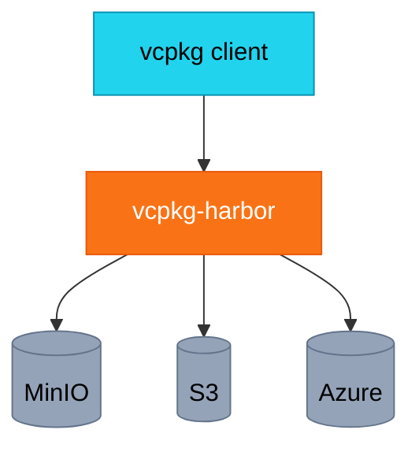

# vcpkg-harbor

**Binary cache server for vcpkg with plugin-based storage backends**

vcpkg-harbor is a high-performance binary cache server designed for Microsoft's vcpkg package manager. It allows teams to share pre-built C++ packages, dramatically reducing build times.

## Features

- **Multiple Storage Backends**: MinIO, AWS S3, Azure Blob, Google Cloud Storage, or local filesystem
- **Plugin Architecture**: Easy to add custom storage backends
- **Web Dashboard**: Monitor cache statistics and browse packages
- **Prometheus Metrics**: Built-in metrics endpoint for monitoring
- **Authentication**: Token and HTTP Basic authentication support
- **High Performance**: Async Python with streaming uploads/downloads

## Quick Start

### Using Docker Compose (Recommended)

```bash
# Clone the repository
git clone https://github.com/rennerdo30/vcpkg-harbor.git
cd vcpkg-harbor

# Start with Docker Compose (includes MinIO)
docker-compose up -d
```

### Using pip

```bash
# Install vcpkg-harbor
pip install vcpkg-harbor

# Start with filesystem storage
VCPKG_STORAGE_TYPE=filesystem vcpkg-harbor
```

### Configure vcpkg

```bash
# Set the binary cache URL
export VCPKG_BINARY_SOURCES="http,http://localhost:15151/{name}/{version}/{sha}"

# Install packages (will cache binaries)
vcpkg install zlib boost
```

## Architecture



## Documentation

- [Installation](getting-started/installation.md)
- [Configuration](getting-started/configuration.md)
- [Storage Backends](user-guide/storage-backends.md)
- [Deployment](deployment/docker.md)

## License

MIT License - see [LICENSE](https://github.com/rennerdo30/vcpkg-harbor/blob/main/LICENSE) for details.
