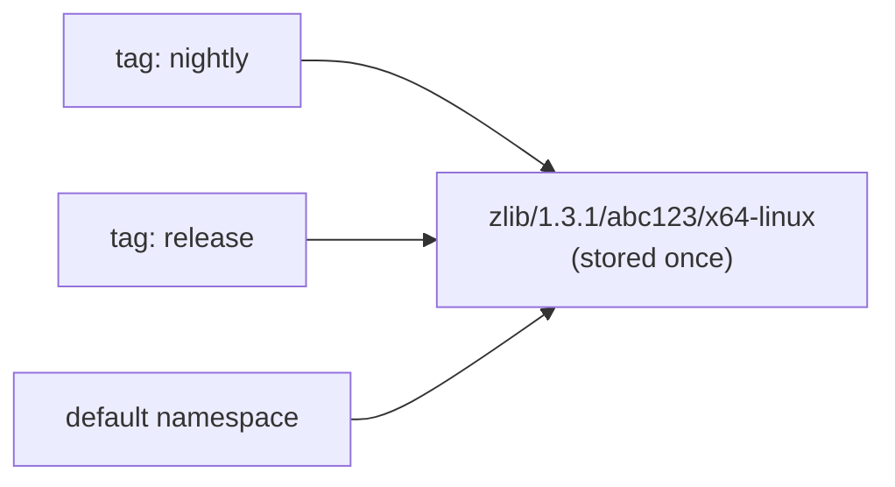

# Build Tags

A **build tag** lets several build streams -- nightly, release, per-PR CI, a
developer's laptop -- share a single vcpkg-harbor server while each keeps its own
view of the cache. Tags are isolated: a package uploaded to `nightly` is not
served to `release`, so a broken nightly build can never leak into a release
build.

Under the hood a package is still stored only **once**. Tags reference the stored
bytes and harbor counts the references, so tagging the same package in ten
streams costs the storage of one.

## Using a tag

A tag is an optional first path segment, so **no vcpkg client change is needed**:
append the tag to the base URL you already configure.

```bash
# Untagged (default namespace) - unchanged behaviour
export VCPKG_BINARY_SOURCES="clear;http,https://harbor.example/{name}/{version}/{sha}/{triplet},readwrite"

# Nightly stream
export VCPKG_BINARY_SOURCES="clear;http,https://harbor.example/nightly/{name}/{version}/{sha}/{triplet},readwrite"

# Per-PR CI stream
export VCPKG_BINARY_SOURCES="clear;http,https://harbor.example/pr-1234/{name}/{version}/{sha}/{triplet},readwrite"
```

The same works for the Azure style source, where the tag is simply part of the
base URL:

```bash
export VCPKG_BINARY_SOURCES="clear;x-azurl,https://harbor.example/nightly,,readwrite"
```

Both path shapes are served by the same endpoints:

| Shape | Path | Namespace |
|-------|------|-----------|
| Tagged | `/{tag}/{name}/{version}/{sha}/{triplet}` | the tag |
| Untagged | `/{name}/{version}/{sha}/{triplet}` | the default namespace |

Dashboard and service routes are one or two segments long, so they never collide
with either shape.

## Deduplication and reference counting

vcpkg identifies a binary package by `name/version/sha/triplet`, and `sha` is the
ABI hash. Harbor uses that 4-tuple to locate a candidate for deduplication,
then compares SHA-256 digests of both byte streams before sharing the object.



Consequences:

- Uploading a package another tag already holds stores no new bytes. The upload
  response reports `"deduplicated": true`.
- Uploading a package **the same tag** already holds is still `409 Conflict`.
- Deleting a package from one tag only drops that tag's reference. Other tags
  keep working; the bytes are removed when the last reference goes.
- Uploading *different* bytes for an existing identity returns `409 Conflict`
  and does not add a reference. Use a different ABI hash, or disable deduplication
  to store different bytes in separate tags.

Deduplication can be turned off with `VCPKG_TAGS_DEDUPE=false`, in which case
each tag keeps a private copy of the bytes under
`_harbor/objects/{tag}/{name}/{version}/{sha}/{triplet}`. The untagged namespace
always keeps the flat layout.

## Tag names

Tags are validated before they are used, so a typo cannot silently create a new
namespace:

- The name must match `VCPKG_TAGS_PATTERN`, by default
  `^[A-Za-z0-9][A-Za-z0-9._-]{0,63}$`.
- If `VCPKG_TAGS_ALLOWED` is set, only the listed names are accepted.
- The default namespace name (`_default`) is reserved and cannot be requested as
  a tag. Service prefixes (`static`, `partials`, `api`, `health`, `metrics`)
  and `_harbor` are also reserved.

A rejected tag returns `400 Bad Request` with the reason. If build tags are
disabled entirely (`VCPKG_TAGS_ENABLED=false`) the tagged shape is not part of
the API and returns `404 Not Found`.

## Per-tag retention

Two optional limits keep a stream from growing without bound. Both are disabled
by default (`0` means unlimited) and are enforced after each upload, evicting the
oldest entries of that tag first:

| Variable | Meaning |
|----------|---------|
| `VCPKG_TAGS_MAX_PACKAGES_PER_TAG` | Maximum number of packages a tag keeps |
| `VCPKG_TAGS_MAX_BYTES_PER_TAG` | Maximum total size a tag keeps, in bytes |

Eviction removes the tag's reference. Bytes that another tag still references are
kept, so a short-lived CI tag cannot delete a release artifact.

```bash
# Keep the last 500 packages of every tag
VCPKG_TAGS_MAX_PACKAGES_PER_TAG=500
```

## Storage layout

Packages stay where they always were, and harbor's own bookkeeping lives under
the reserved `_harbor/` prefix (never a valid vcpkg port name):

```
cache/
├── zlib/1.3.1/abc123/x64-linux          # the package, stored once
└── _harbor/
    ├── refs/zlib/1.3.1/abc123/x64-linux.json    # {"namespaces":["nightly","release"],...}
    ├── tags/nightly/zlib/1.3.1/abc123/x64-linux.json
    └── tags/release/zlib/1.3.1/abc123/x64-linux.json
```

The same layout is used by every storage backend (filesystem, MinIO, S3, Azure
Blob, GCS) through the storage backend interface, so a cache can be moved between
backends unchanged. Bookkeeping documents are never reported as packages by the
dashboard, the statistics or the package listing.

## Upgrading an existing deployment

**No migration is required and no existing cache is orphaned.** The untagged
routes and the untagged storage layout are byte compatible with releases that had
no build tags, so:

- Packages uploaded before this feature existed have no index entry. They stay
  readable and deletable through the untagged routes.
- The first time such a package is tagged it is adopted into the default
  namespace before the tag reference is added, so untagged clients keep seeing it.
- Setting `VCPKG_TAGS_ENABLED=false` restores the exact previous behaviour, with
  no bookkeeping documents written at all.

## Limitations

- Build tags require one server process and one deployment replica per storage
  backend. The default is `VCPKG_SERVER_WORKERS=1`; configuring more workers with
  tags enabled fails at startup. When launching uvicorn directly, also use
  `--workers 1`. Distributed writers require a transactional shared index and
  are not supported by this implementation.
- Uploads, deletes and retention are serialized within the process to keep object
  lifetime and reference updates consistent. Reads remain concurrent.
- A missing object is a cache miss; a re-upload repairs it, and DELETE can remove
  its stale membership record.
- Retention scans a tag's membership records when limits are enabled. Large tags
  can incur one metadata read per entry per upload.
- The dashboard does not display tags yet; it lists stored packages.
